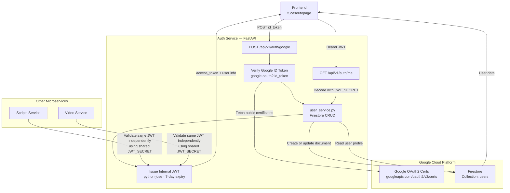

# Tu Caserito — Auth Service

## Overview

The Auth Service is the identity gateway for the Tu Caserito platform. It accepts Google ID tokens issued by the browser's Sign-In button, verifies them against Google's public certificate authority, and issues platform-internal JWTs that every other microservice uses to authenticate requests. On first login it auto-creates a user record in Firestore; on subsequent visits it updates `last_login`. Because all services share the same `JWT_SECRET`, each one validates tokens independently without calling back to this service on every request.

---

## Architecture



---

## Tech Stack

| Layer | Technology |
|---|---|
| Framework | FastAPI 0.115.5 |
| Server | Uvicorn 0.32.1 |
| Google Auth | `google-auth` 2.38.0 · `google-auth-oauthlib` 1.2.1 |
| JWT | `python-jose[cryptography]` 3.3.0 |
| Database | Google Cloud Firestore (`google-cloud-firestore` 2.19.0) |
| Validation | Pydantic 2.10.4 · `pydantic-settings` 2.7.1 |
| Config | `python-dotenv` 1.0.1 |
| Deployment | Vercel (serverless) |

---

## Environment Variables

| Variable | Required | Description |
|---|---|---|
| `GOOGLE_CLIENT_ID` | Yes | Google OAuth2 Client ID — validates the `aud` claim in incoming ID tokens |
| `GOOGLE_CREDENTIALS_JSON` | Yes | GCP service account credentials as a JSON string — grants Firestore read/write access |
| `JWT_SECRET` | Yes | Signing secret for internal JWTs — **must match across all services** |
| `ALLOWED_ORIGINS` | Optional | JSON array of allowed CORS origins (default: `["https://www.tucaserito.com"]`) |

> **Security policy:** Never commit `.env` or any secrets to version control. Use `.env.example` as the reference template. Any `X-Admin-Key`-style secrets are service-to-service only and must never be exposed to the browser.

---

## API Endpoints

### `POST /api/v1/auth/google`

Exchanges a Google ID token for a platform JWT. Creates the user record in Firestore on first login.

**Request body:**
```json
{
  "id_token": "<Google ID token from client>"
}
```

**Response `200 OK`:**
```json
{
  "access_token": "<internal JWT>",
  "token_type": "bearer",
  "user": {
    "google_id": "string",
    "email": "string",
    "name": "string",
    "picture": "string",
    "created_at": "ISO 8601",
    "last_login": "ISO 8601",
    "is_active": true,
    "is_new_user": false
  }
}
```

**Error responses:** `400` (invalid token), `401` (verification failed), `403` (account inactive)

---

### `GET /api/v1/auth/me`

Returns the profile of the currently authenticated user.

**Headers:** `Authorization: Bearer <access_token>`

**Response `200 OK`:**
```json
{
  "google_id": "string",
  "email": "string",
  "name": "string",
  "picture": "string",
  "is_active": true
}
```

**Error responses:** `401` (invalid/expired token), `403` (inactive account), `404` (user not found)

---

### `GET /health`

Liveness probe.

**Response `200 OK`:** `{ "status": "ok", "service": "Tu Caserito Auth Service" }`

---

## How to Run Locally

### Prerequisites
- Python 3.11+
- A Google Cloud project with Firestore enabled in Native mode
- A Google OAuth2 Web Client ID (from [Google Cloud Console](https://console.cloud.google.com/apis/credentials))

### Steps

```bash
# 1. Navigate to the service directory
cd auth_service_tucaserito

# 2. Create and activate a virtual environment
python -m venv venv
source venv/bin/activate     # macOS / Linux
venv\Scripts\activate        # Windows

# 3. Install dependencies
pip install -r requirements.txt

# 4. Configure environment variables
cp .env.example .env
# Edit .env and fill in:
#   GOOGLE_CLIENT_ID=<your-oauth2-client-id>
#   GOOGLE_CREDENTIALS_JSON=<service-account-json-as-single-line-string>
#   JWT_SECRET=<at-least-32-char-random-string>
#   ALLOWED_ORIGINS=["http://localhost:3000"]

# 5. Start the development server
uvicorn app.main:app --reload --port 8001
```

The service will be available at `http://localhost:8001`.  
Interactive API docs: `http://localhost:8001/docs`
